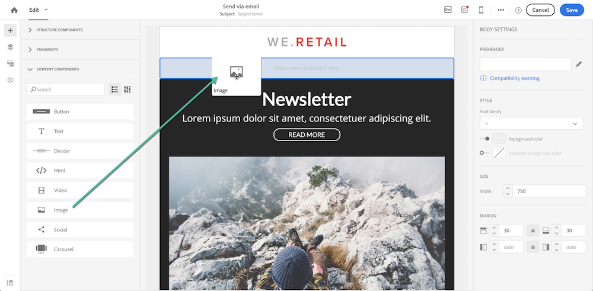
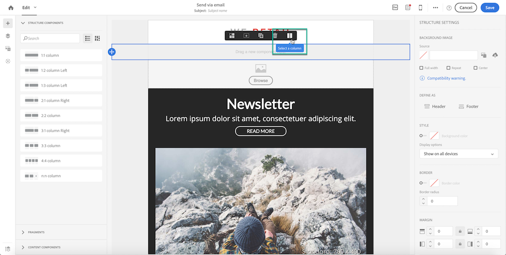
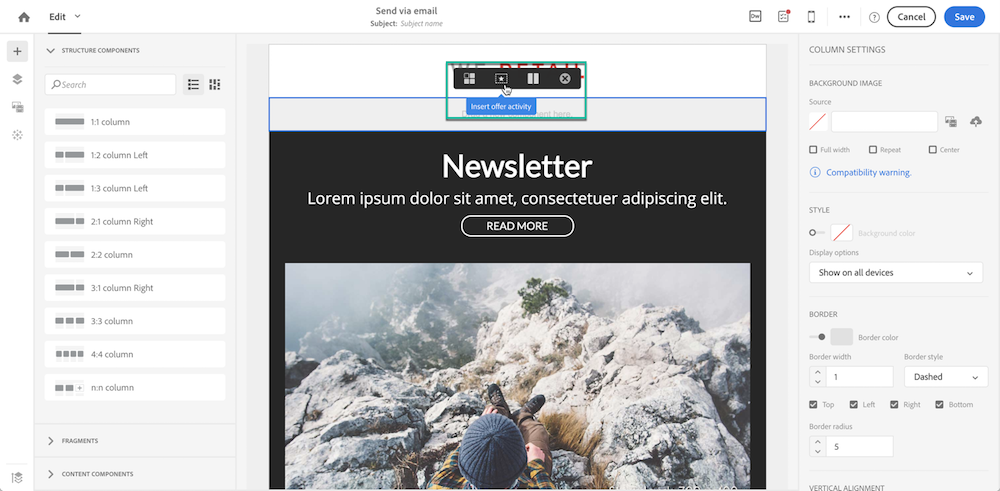
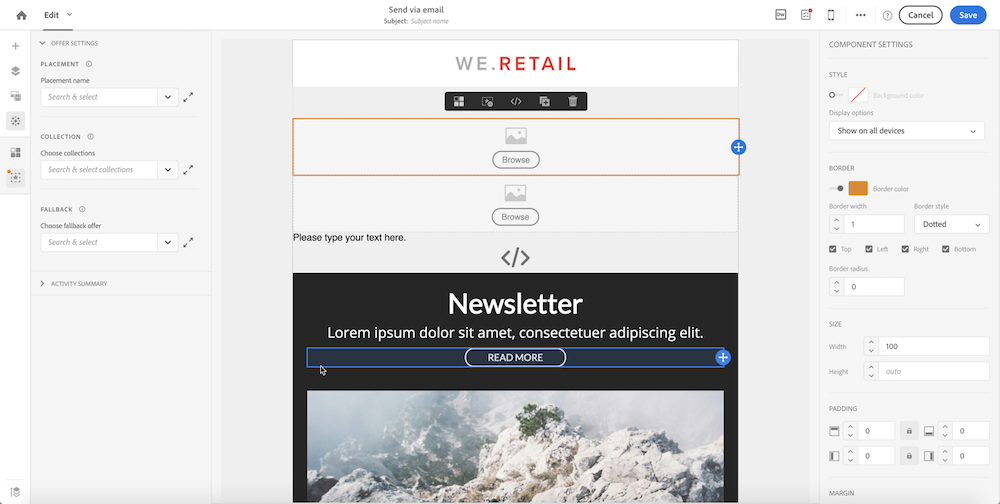
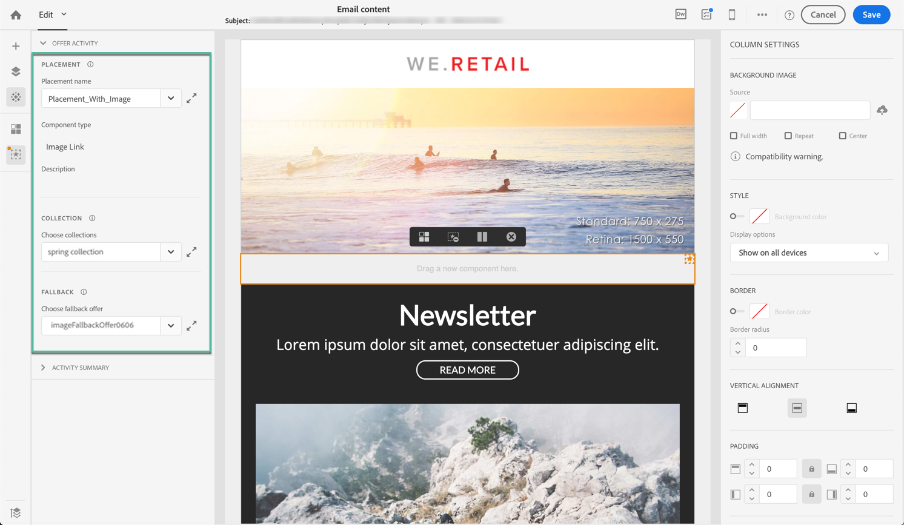
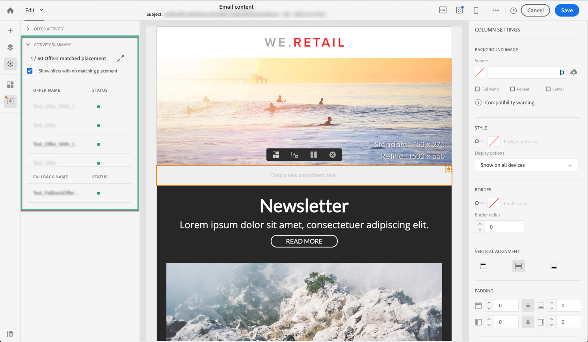

# Inserting offer activities into email deliveries {#xxxx}

>[!NOTE]
>
>This feature is available for single-send and recurring email messages only. It is not available with transactional messages.

To insert an offer activity into an email delivery, follow these steps:

1. Open a new delivery in the Email Designer. Global concepts on email creation are detailed in [Campaign Standard documentation](https://docs.adobe.com/content/help/en/campaign-standard/using/designing-content/designing-content-in-adobe-campaign.html).

1. Select the component in the email that will contain the offer activity, or drag a new one from the left pane:

    * To insert an **image** offer, drag an image content component at the location of your choice in the email structure, then select it.

        

    * To insert a **text** or **HTML** offer, drag and drop a structure component into the location of your choice of the email structure, then click the **[!UICONTROL Select a column]** button to select the component's column.

        

1. Click the **[!UICONTROL Insert offer activity]** button.

    

1. The offer activity is added to the component. You can now configure it using the dedicated menu that displays in the left pane. It allows you to configure the offer activity by selecting a placement, an offer collection, and a fallback offer.

    >[!NOTE]
    >
    >If the menu is not visible anymore, for example when clicking outside of the offer component, click the Offer button from the left pane to display it again.

    

    1. In the **[!UICONTROL Placements]** section, select the placement that will be used to present offers.

        >[!NOTE]
        >
        >Make sure to select placements that are compatible with the component type selected in the email structure (text / HTML / image).

    1. In the **[!UICONTROL Collections]** section, select the collection that contains the offers that you want to consider. For more on offers collections, see .

    1. In the **[!UICONTROL Fallback Offers]** section, select the fallback offer that will be presented to customers who are not eligible for the considered offers.

        

1. Select the **[!UICONTROL Summary]** tab to visualize the offers that are considered, and the selected fallback offer.

    >[!NOTE]
    >
    >At this step, all offers matching the selected placement are displayed. The decision rule that has been associated to the offer is not yet taken into account.

    

1. Click the **[!UICONTROL Done]** button to confirm the offer activity configuration.

Once created, you can still edit the offer activity settings or visualize the summary directly from the **[!UICONTROL Offer settings]** menu.

You can now save, preview and send your delivery (see ).
