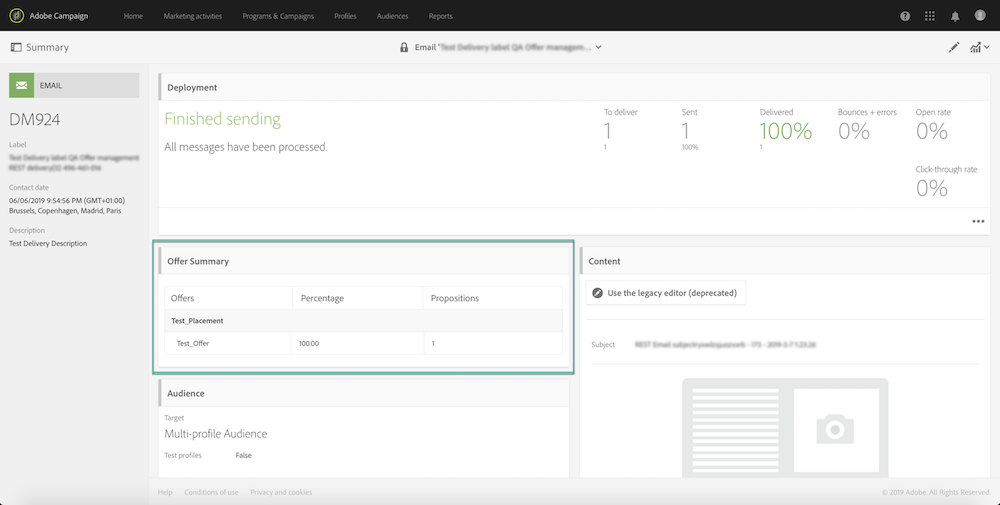
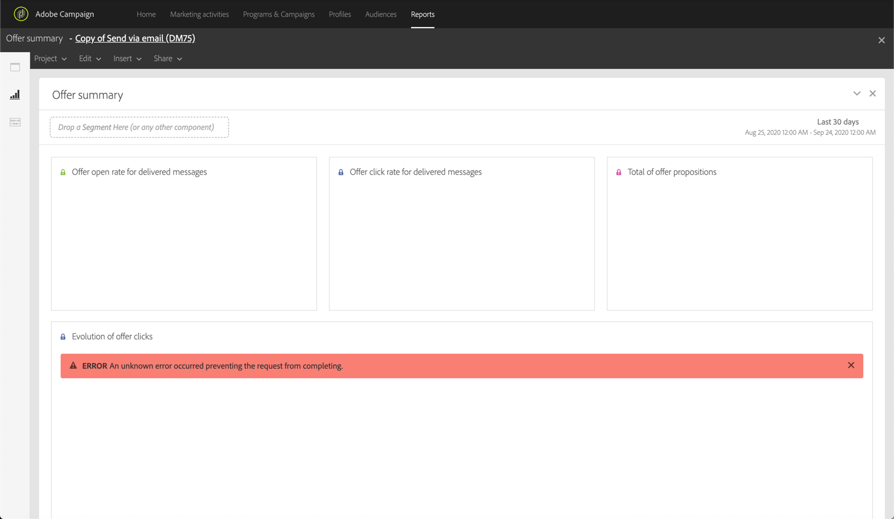

# Sending emails with offer activites {#sending-emails-with-offer-activities}

Once an offer activity is inserted into a delivery, you can finalize and send it as usual. Global concepts on delivery sending are presented in [Campaign Standard documentation](https://docs.adobe.com/content/help/en/campaign-standard/using/testing-and-sending/get-started-sending-messages.html).

Once the message has been sent, you can retrieve information on the offers that have been presented to the profiles in the delivery summary.

The **[!UICONTROL Offer Summary]** section provides information on the **propositions** made to the targeted profiles for each placement.

A proposition is the presentation of one or several offers to a contact.

In the example above, the Offers Summary indicates that:

* offers were presented to 2 profiles in the banner placement,
* an offer was presented to 1 profile in the email body.

<!--
Basically for any placement, the total propositions will be equal to the audience profile count but if there are say 4 offers delivered at a placement, then the total propositions will get divided in those 4 offers and the percentage split is not fixed but epends on decisioning. In the screen attached, only 1 profile was sent email and he received fallback offer at that placement which is why you are seeing 1 proposition as 100%.)
-->

## Sending logs

In the delivery **[!UICONTROL Sending logs]**, you can visualize the mirror page of the delivery, including the offers that have been presented.

## Dynamic reporting

Campaign Standard reporting capabilities allow you to build dynamic reports based on the sent offers.

To do this, a ready-to-use report is available (**[!UICONTROL Offer summary]**), as well as several **dimensions** and *metrics* related to offers to help you build your own dynamic reports.

For more on dynamic reporting, refer to [Campaign Standard documentation](https://docs.adobe.com/content/help/en/campaign-standard/using/reporting/get-started-reporting.html).

<!--Mukul Gupta and/or I will supply you with this info (screen)-->

<!--see ram for reporting on reporting using platform capabilitie-->