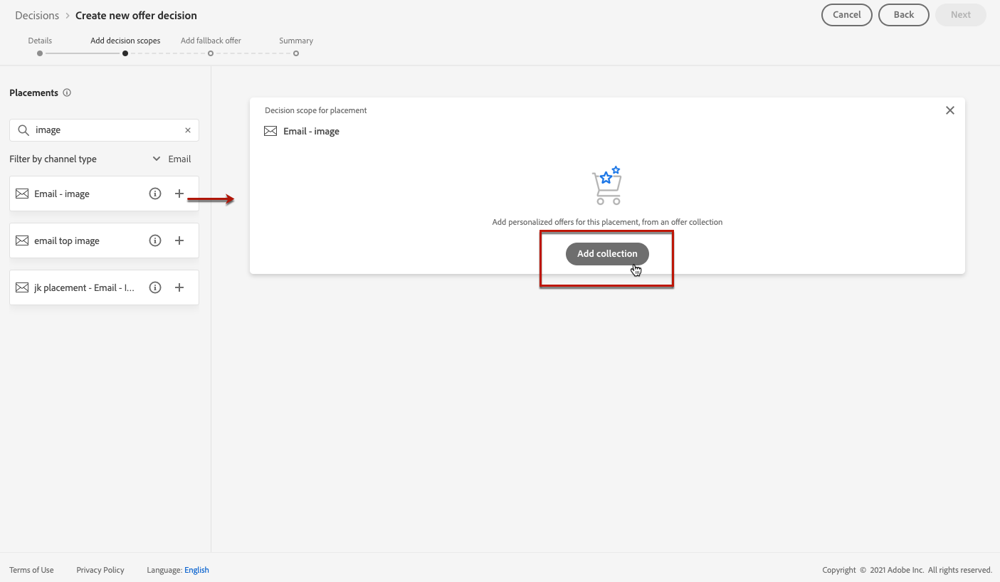
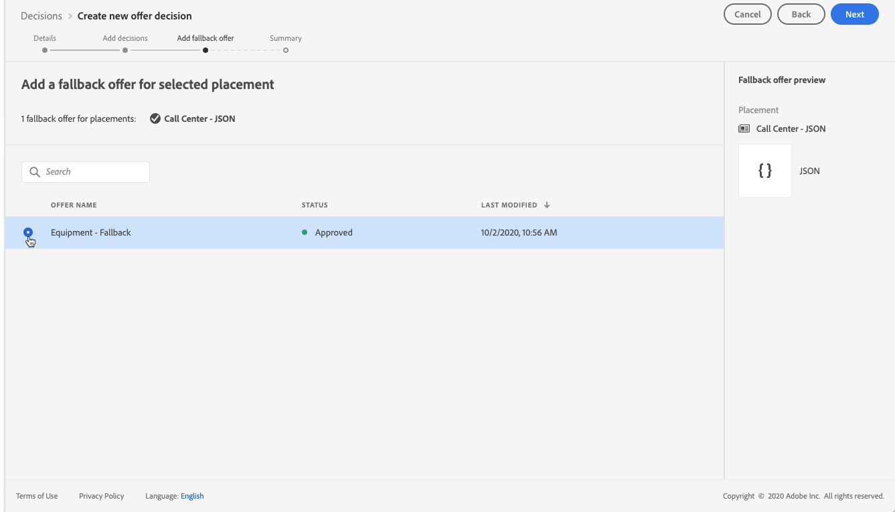

# Create offer activities {#create-offer-activities}

Offer activities are containers for your offers that will leverage the Offer Decision Engine in order to pick the best offer to deliver, depending on the target of the delivery.

 [Discover this feature in video](#video)

The list of offer activities is accessible in the **[!UICONTROL Activities]** menu. Filters are available to help you retrieve activities according to their status or start and end dates.

To create an offer activity, follow these steps:

1. Make sure that the components below have been created in the Offer Library:

    * [Placements](offer-library/using/creating-placements.md),
    * [Collections](offer-library/using/creating-collections.md),
    * [Personalized offers](offer-library/using/creating-personalized-offers.md),
    * [Fallback offers](offer-library/using/creating-fallback-offers.md).

1. Select the **[!UICONTROL Activities]** menu, then click **[!UICONTROL Create activity]**.

1. Specify the activity's name as well as its start and end date and time, then click **[!UICONTROL Next]**.

    

1. Drag and drop a placement from the list to add it to the activity, then click **[!UICONTROL Add collection]**.

    

1. Select the collection that contains the offers to consider, then click **[!UICONTROL Add]**.

    

1. The selected offers are added to the placement. Click **[!UICONTROL Next]** to confirm.

    In this example, we selected two offers that will display into a JSON-type placement aimed at presenting offers into a call center solution.

    

1. Select the fallback offer that will be presented as a last resort to the customers that do not match the offers eligibility rules and constraints, then click **[!UICONTROL Next]**.

    

1. If everything is configured properly and your activity is ready to be used to  present offers to customers, click **[!UICONTROL Finish]**, then select **[!UICONTROL Save and activate]**.

    You can also save the activity as draft, in order to edit and activate it later on.

    

1. The activity displays in the list with the **[!UICONTROL Live]** or **[!UICONTROL Draft]** status, depending on wether you activated it or not in the previous step.

    It is now ready to be used to deliver offers to customers. You can select it to display its properties and edit or suppress it.

    

>[!NOTE]
>
>Once an offer activity has been created, you can monitor all the changes that have been made to it using the **[!UICONTROL Change log]** tab (see [Monitoring changes to offers and offer activities](../../get-started/using/user-interface.md#monitoring-changes)).

## Tutorial video {#video}

>[!VIDEO](https://video.tv.adobe.com/v/329606?quality=12)
