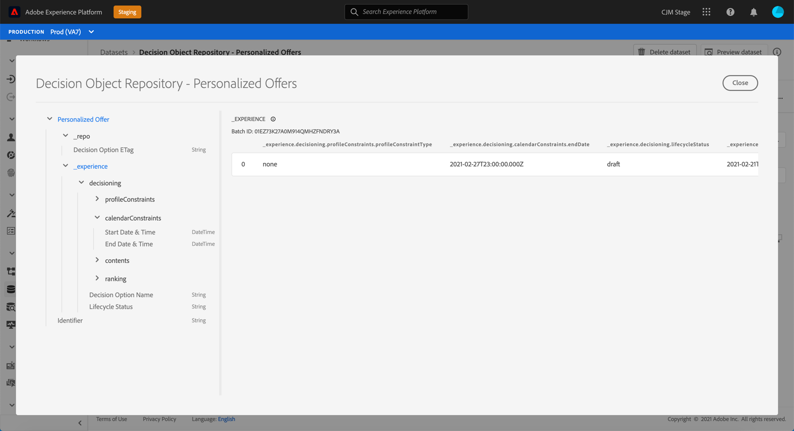

# Access the exported dataset {#access-exported-dataset}

The exported offer catalog is accessible in Adobe Experience Platform **[!UICONTROL Datasets]** menu. One dataset is created for each object from your Offer Library:

Click a dataset to access its details.

The **[!UICONTROL Preview dataset]** button allows you to display the most recent successful batch in this dataset. The left pane provides information about the types of data that have been exported with the batch.

For more information on how to browse and work with datasets, refer to [Adobe Experience Platform datasets documentation](https://experienceleague.adobe.com/docs/experience-platform/catalog/datasets/user-guide.html?lang=en#getting-started).
