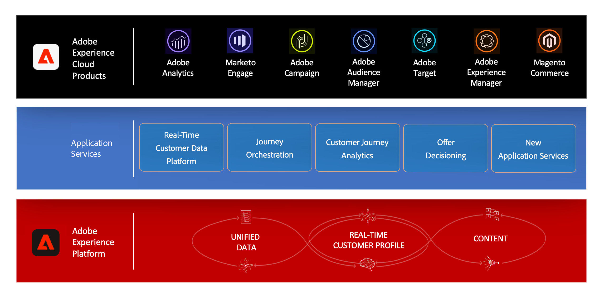
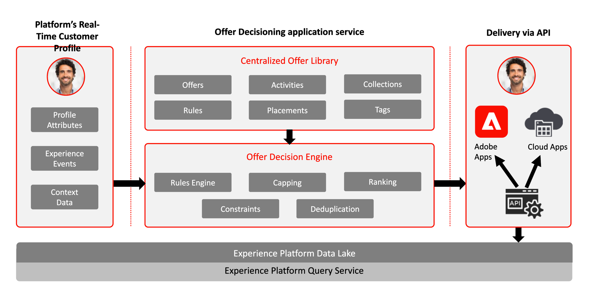
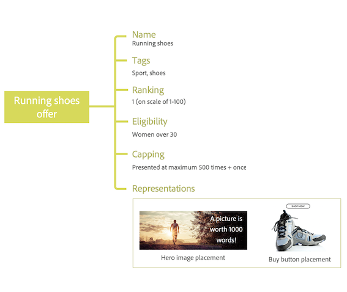
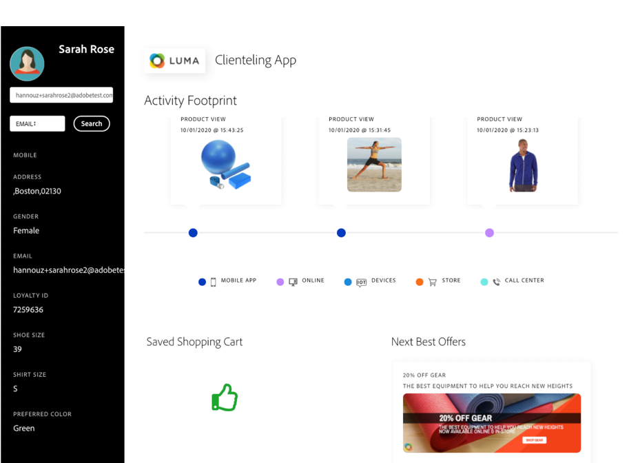

# Get started with [!DNL Offer Decisioning] {#about-offer-decision}

>[!IMPORTANT]
>
>To get access to the [!DNL Offer Decisioning] service, reach out to Adobe Customer Care or visit [Adobe Enterprise Support page](https://experienceleague.adobe.com/?support-solution=Experience+Platform#support).

[!DNL Offer Decisioning] is an Application Service integrated with Adobe Experience Platform. It allows you to leverage Adobe Experience Platform to deliver the best offer and experience to your customers across all touch points at the right time.

 

 [Watch these tutorial videos](#tutorial-videos) for more on [!DNL Offer Decisioning].

## [!DNL Offer Decisioning] service architecture

The [!DNL Offer Decisioning] application service consists in two main components:

* The **Centralized Offer Library** is the interface where you create and manage the different elements that compose your offers, and define their rules and constraints.
* The **Offer Decision Engine** leverages Adobe Experience Platform data and Real-time Customer profiles, along with the Offer Library, in order to select the right time, customers and channels to which offers will be delivered.

 

Benefits include:

* Improved campaign performance by delivering personalized offers across multiple channels,
* Improved workflows: instead of creating multiple deliveries or campaigns, marketing teams can improve workflows by creating a single delivery and vary the offers in different parts of the template,
* Control over the number of times an offer is shown across campaigns and customers.

## About offers and offer activities {#offers-offer-activities}

An **Offer** is made up of content, eligibility rules and constraints that define the conditions under which it is presented to your customers.

It is created using the **Offer Library**, which provides a central offer catalog where you can associate eligibility rules and constraints with multiple pieces of content to create and publish offers (see [Offer Library user interface](../get-started/user-interface.md)).

 

Once the Offer Library has been enriched with offers, you can integrate your offers into **offer activities**.

Offer activities are containers for your offers that will leverage the Offer Decision Engine in order to pick the best offer to deliver depending on the target of the delivery.

## Common use cases

[!DNL Offer Decisioning] capabilities and integration with Adobe Experience Platform allow you to cover numerous use cases to help you increase customers' engagement and conversion.

* Display on your website homepage offers that will match the visiting customer's point of interest, based on data from Adobe Experience Platform.

     

* If customers walk near one of your stores, send them push notifications reminding them of available offers according to their attributes (loyalty level, gender, former purchases...).

     

* Offer decisioning also helps you enhance your customers' experience when contacting your support team. [!DNL Offer Decisioning] APIs allow you to display in your call center agents' portal information about the customer's redeemed and next best offers.

     

## Tutorial videos {#tutorial-videos}

### What is [!DNL Offer Decisioning]? {#what-is-offer-decisioning}

The video below provides an introduction to [!DNL Offer Decisioning] key capabilities, architecture and use cases:

>[!VIDEO](https://video.tv.adobe.com/v/326961?quality=12&learn=on)

### Define and manage offers {#use-offer-decisioning}

The video below shows how to use [!DNL Offer Decisioning] to define and manage your offers and leverage real-time customer data.

>[!VIDEO](https://video.tv.adobe.com/v/326841?quality=12&learn=on)
