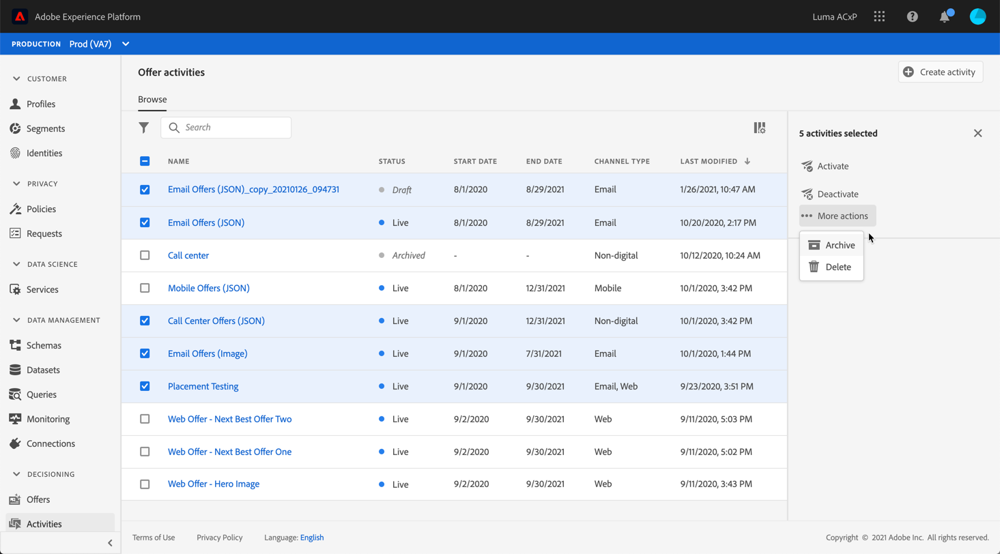
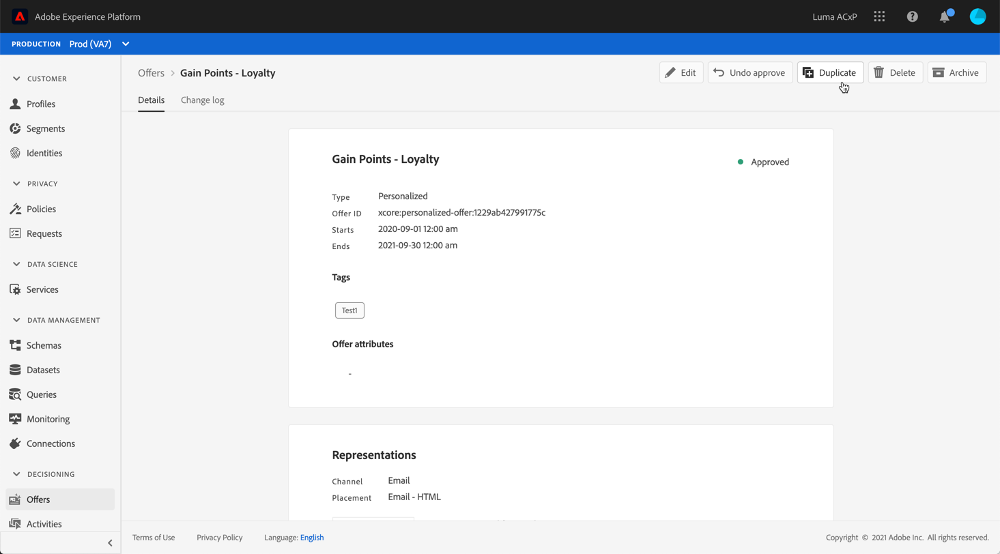

# User Interface {#user-interface}

The Offer Library allows you to create and manage your placements and offers in one single place, as well as monitor all the created offer activities.

It is accessible from Adobe Experience Platform **[!UICONTROL Decisioning]** menu.

>[!NOTE]
>
>If you are having issues accessing the Offer Library or some of its feature, check with an Admin user that you have been granted the required rights. See [Grant access to [!DNL Offer Decisioning]](../../get-started/using/granting-access-to-offer-decisioning.md)

The **[!UICONTROL Offers]** menu allows you to navigate through the different functionalities of [!DNL Offer Decisioning]. 

* **[!UICONTROL Browse]**: access your personalized and fallback offers or create new ones. See [Creating an offer](../../offer-library/using/creating-personalized-offers.md) and [Creating a fallback offer](../../offer-library/using/creating-fallback-offers.md).

* **[!UICONTROL Collections]**: create and manage static and dynamic offer collections. See [About offer collections](../../offer-library/using/creating-collections.md).

* **[!UICONTROL Placements]**: create and manage placements where your offers will display and tags for your offers. See [Creating placements](../../offer-library/using/creating-placements.md).

* **[!UICONTROL Decision Rules]**: manage the conditions under which your offers are presented. See [Creating a decision rule](../../offer-library/using/creating-decision-rules.md).

* **[!UICONTROL Tags]**: create and manage placements tags to organize and filter your offers. See [Creating tags](../../offer-library/using/creating-tags.md).

The **[!UICONTROL Activities]** menu allows you to see all the offer activities that have been created to deliver your offers. See [Create offer activities](../../create-offer-activities.md)

## Search and filter information

A **search bar** is available in some menus to allow you to search for an item.

**Filters** can also be accessed by clicking the filter icon on the top left of the list. They allows you to filter the displayed elements according to different criteria. You can, for example, filter the placements that have been created for the email communication channel and image-type contents.

## Customize displayed information

Lists from [!DNL Offer Decisioning] menus can be personalized using the configuration button on the top right of the lists.

This allows you to choose the information to display according to your needs.

Note that columns personalization is saved for each user.

## Information pane and additional actions {#information-pane-actions}

In the different lists, select an element to display an information pane that will allow you to retrieve information and perform basic actions on the element. 

For offers and offer activities, you can also click its name from the list to access a dedicated **[!UICONTROL Details]** tab.

The offers and offer activities lists also allow you to perform bulk actions on several elements. To do this, select the desired offers or offer activities, then select the action you want to perform from the information pane. 

Note that you can also duplicate an existing offer or offer activity in order to create a copy with the **[!UICONTROL Draft]** status. This can be performed either from the information pane or from an offer or offer activity's **[!UICONTROL Details]** tab.

## Monitoring changes to offers and offer-activities {#monitoring-changes}

The Offer Library allows you to monitor any change that has been made to an offer or an offer activity.

To do this, open the offer or offer activity by clicking on its name in the **[!UICONTROL Browse]** tab, then select the **[!UICONTROL Change log]** tab.

All the changes that have been made display in this screen, as well as the name of the user that performed the changes.

