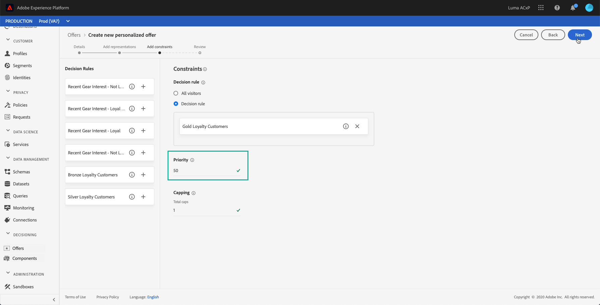
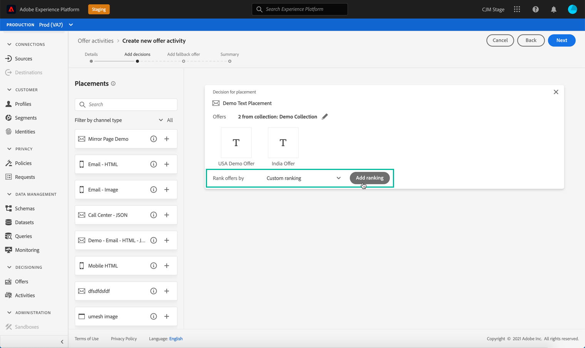
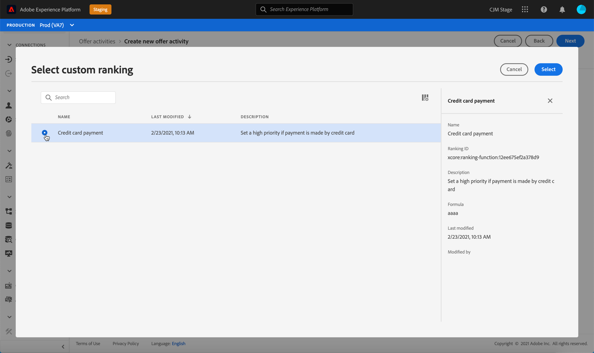
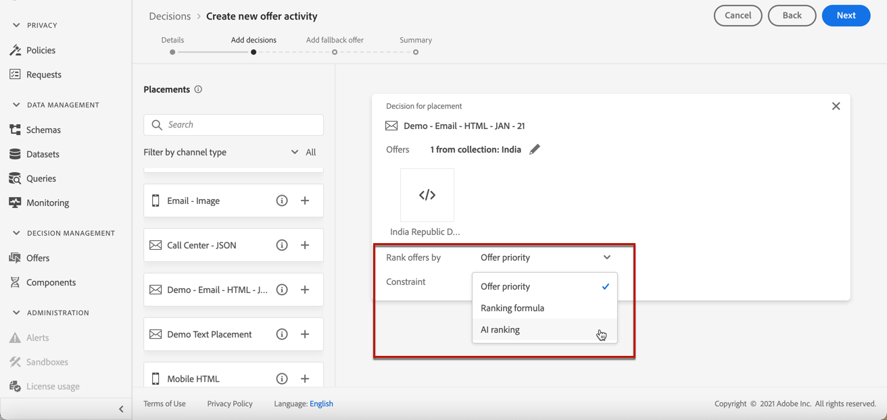
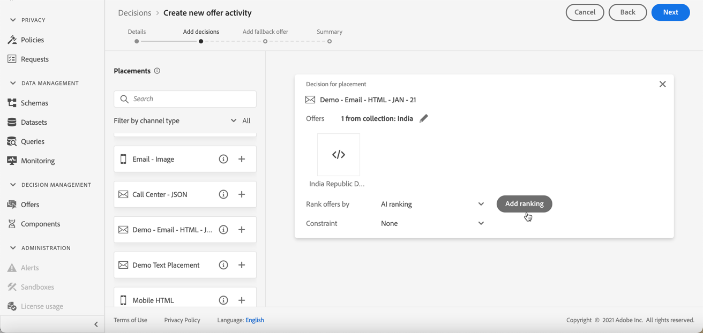

# Configure offers selection in decisions {#offers-selection-in-activities}

## About Offers priority {#about-offers-priority}

By default, when several offers are eligible for a given placement, the offers with the highest **priority** will be delivered to the customers first. Offers' priority scores are assigned when creating an offer (see [Create a personalized offer](../offer-library/creating-personalized-offers.md)).

Additionally, Offer Decisioning allows you to create **ranking formulas**. These are formulas that determine which offer should be presented first for a given placement, rather than taking into account the offers' priority scores. For example, you can boost the priority of all offers where the end date is less than 24 hours from now, or boost offers from the "running" category if the profile's point of interest is "running". 

For more on how to create a ranking formula, refer to [this section](../offer-library/create-ranking-formulas.md).

## Assign a ranking formula to a placement {#assign-ranking-formula}

Once a ranking formula has been created, you can assign it to a placement in a decision (previously known as offer activity). To do this, follow the steps below:

* Create a decision or edit an existing one, then create the placements that will contain your offers (see [Create decisions](../offer-activities/create-offer-activities.md)).

* For each placement, select **[!UICONTROL Ranking]** from the drop-down list, then click **[!UICONTROL Add ranking]**.

    

* Select the desired ranking formula, then click **[!UICONTROL Select]**.

    

The ranking formula is now associated to the placement. If mutiple offers are eligible to be presented in this placement, the decision will use the ranking formula's formula to calculate which offer to deliver first.

## Using a ranking strategy {#using-ranking}

Once a ranking strategy has been created, you can assign it to a placement in a decision (previously known as offer activity). To do this this, follow the steps below:

1. Create a decision or edit an existing one.
1. Add the placements that will contain your offers (see [Create decisions](../offer-activities/create-offer-activities.md)).
1. For each placement, add a collection.
1. Choose to rank offers by **[!UICONTROL AI ranking]** from the drop-down list.

    

1. Click **[!UICONTROL Add ranking]**.

    

1. Select the ranking strategy that you created. All the details of the ranking strategy are displayed.

    

    The ranking strategy is now associated with the placement.

1. Click **[!UICONTROL Next]** to confirm and save your decision.