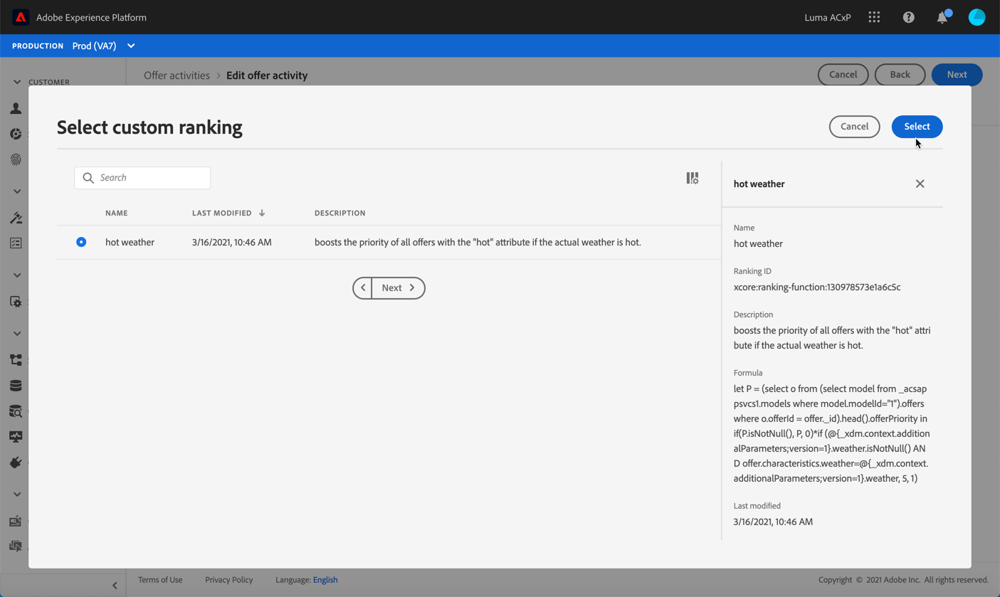

# Configure offers selection in activities {#offers-selection-in-activities}

## About Offers priority {#about-offers-priority}

By default, when several offers are eligible for a given placement, the offers with the highest **priority** will be delivered to the customers first. Offers' priority scores are assigned when creating an offer (see [Create a personalized offer](../offer-library/creating-personalized-offers.md)).

Additionally, Offer Decisioning allows you to create **ranking formulas**. These are formulas that determine which offer should be presented first for a given placement, rather than taking into account the offers' priority scores. For example, you can boost the priority of all offers where the end date is less than 24 hours from now, or boost offers from the "running" category if the profile's point of interest is "running". 

For more on how to create a ranking formula, refer to [this section](../offer-library/create-ranking-formulas.md).

## Assign a ranking formula to a placement {#assign-ranking-formula}

Once a ranking formula has been created, you can assign it to a placement in an offer activity. To do this, follow the steps below:

* Create an offer activity or edit an existing one, then create the placements that will contain your offers (see [Create offer activities](../offer-activities/create-offer-activities.md)).

* For each placement, select **[!UICONTROL Ranking]** from the drop-down list, then click **[!UICONTROL Add ranking]**.

    

* Select the desired ranking formula, then click **[!UICONTROL Select]**.

    

The ranking formula is now associated to the placement. If mutiple offers are eligible to be presented in this placement, the offer activity will use the ranking formula's formula to calculate which offer to deliver first.
