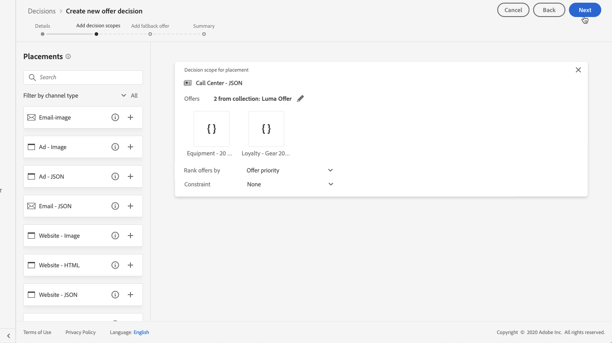

# Create decisions {#create-offer-activities}

Decisions (previously known as offer activities) are containers for your offers that will leverage the Offer Decision Engine in order to pick the best offer to deliver, depending on the target of the delivery.

 [Discover this feature in video](#video)

The list of decisions is accessible in the **[!UICONTROL Offers]** menu / **[!UICONTROL Decisions]** tab. Filters are available to help you retrieve decisions according to their status or start and end dates.

Before creating a decision, make sure that the components below have been created in the Offer Library:

* [Placements](../offer-library/creating-placements.md)
* [Collections](../offer-library/creating-collections.md)
* [Personalized offers](../offer-library/creating-personalized-offers.md)
* [Fallback offer](../offer-library/creating-fallback-offers.md)

## Create the decision {#create-activity}

1. Access the decisions list, then click **[!UICONTROL Create activity]**.

1. Specify the decision's name as well as its start and end date and time, then click **[!UICONTROL Next]**.

    

## Add decision scopes {#add-decision-scopes}

1. Drag and drop a placement from the list to add it to the decision, then click **[!UICONTROL Add collection]**.

    

    >[!NOTE]
    >
    >The same placement can be selected multiple times in the decision.

1. Select the collection that contains the offers to consider, then click **[!UICONTROL Add]**.

    

1. The selected offers are added to the placement. In this example, we selected two offers that will display into a JSON-type placement aimed at presenting offers into a call center solution.

    

1. By default, if multiple offers are eligible for this placement, the offers with the highest priority score will be delivered to the customer.

    If you want to use a specific formula or a ranking strategy to choose which eligible offer to deliver, select it from the **[!UICONTROL Rank offers by]** drop-down list. For more on offer ranking methods, refer to [this section](../offer-activities/configure-offer-selection.md).

1. The **[!UICONTROL Constraint]** field restricts the selection of offers for this placement. This constraint can be applied by using a decision rule or one or several Adobe Experience Platform segments.

    To restrict the selection of the offers to the members of an Adobe Experience Platform segments, select **[!UICONTROL Segments]**, then click **[!UICONTROL Add segments]**.

    
    
    Add one or several segments from the left pane, combine them using the **[!UICONTROL And]** / **[!UICONTROL Or]** logical operators, then click **[!UICONTROL Select]** to confirm.

    For more on how to work with segments, refer to the [Segmentation Service documentation](https://experienceleague.adobe.com/docs/experience-platform/segmentation/home.html).

    

    If you want to add a selection constraint for this placement using a decision rule, select the **[!UICONTROL Decision rule]** option, then drag the desired rule from the left pane into the **[!UICONTROL Decision rule]** area. For more on how to create a decision rule, refer to [this section](../offer-library/creating-decision-rules.md). 

    

## Add a fallback offer {#add-fallback}

Select the fallback offer that will be presented as a last resort to the customers that do not match the offers eligibility rules and constraints, then click **[!UICONTROL Next]**.

## Review and save the decision {#review}

If everything is configured properly and your decision is ready to be used to  present offers to customers, click **[!UICONTROL Finish]**, then select **[!UICONTROL Save and activate]**.

You can also save the decision as draft, in order to edit and activate it later on.

The decision displays in the list with the **[!UICONTROL Live]** or **[!UICONTROL Draft]** status, depending on whether you activated it or not in the previous step. 

It is now ready to be used to deliver offers to customers. You can select it to display its properties and edit or suppress it.

>[!NOTE]
>
>Once a decision has been created, you can click its name in the list to access detailed information, and vizualise all the changes that have been made to it using the **[!UICONTROL Change log]** tab (see [Offers and decisions changes log](../get-started/user-interface.md#changes-log)).

## Decision list {#dcision-list}

From the decision list, you can select the decision to display its properties and edit it. You can also change its status, duplicate the offer, or delete it.

Select the **[!UICONTROL Edit]** button to go back to the decision edition mode.

Select an activated decision and click **[!UICONTROL Deactivate]** to set the decision status back to **[!UICONTROL Draft]**.

To set again the status to **[!UICONTROL Activated]**, select the corresponding button that is now displayed.

The **[!UICONTROL More actions]** button enables the actions described below.

* **[!UICONTROL Complete]**: set the decision's status to **[!UICONTROL Complete]**, meaning the decision cannot be called anymore. This action is only available for activated decisions. The decision is still available from the list, but you cannot set its status back to **[!UICONTROL Draft]** or **[!UICONTROL Approved]**. You can still duplicate, delete or archive it. <!--to check-->
* **[!UICONTROL Duplicate]**: creates a decision with the same properties, decision scopes and fallback offer. By default, the new decision has the **[!UICONTROL Draft]** status. <!--or the same status? to check-->
* **[!UICONTROL Delete]**: removes the decision from the list.

    >[!WARNING]
    >
    >The decision and its content are not accessible anymore. This action cannot be undone. <!--to check-->

* **[!UICONTROL Archive]**: set the decision status to **[!UICONTROL Archived]**. The decision is still available from the list, but you cannot set its status back to **[!UICONTROL Draft]** or **[!UICONTROL Approved]**. You can only duplicate or delete it.

You can also delete or change the status of multiple decisions at the same time by selecting the corresponding checkboxes.

## Tutorial video {#video}

>[!VIDEO](https://video.tv.adobe.com/v/329606?quality=12)
