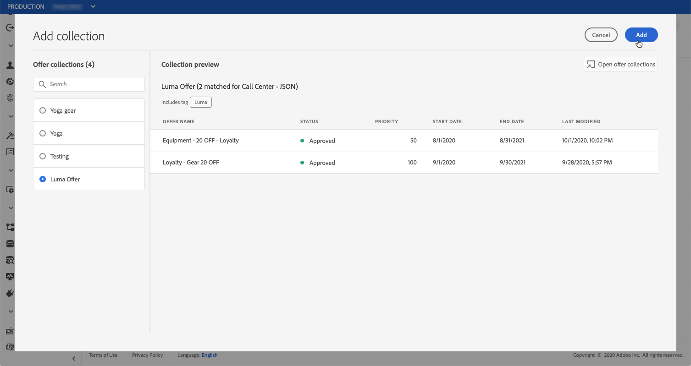
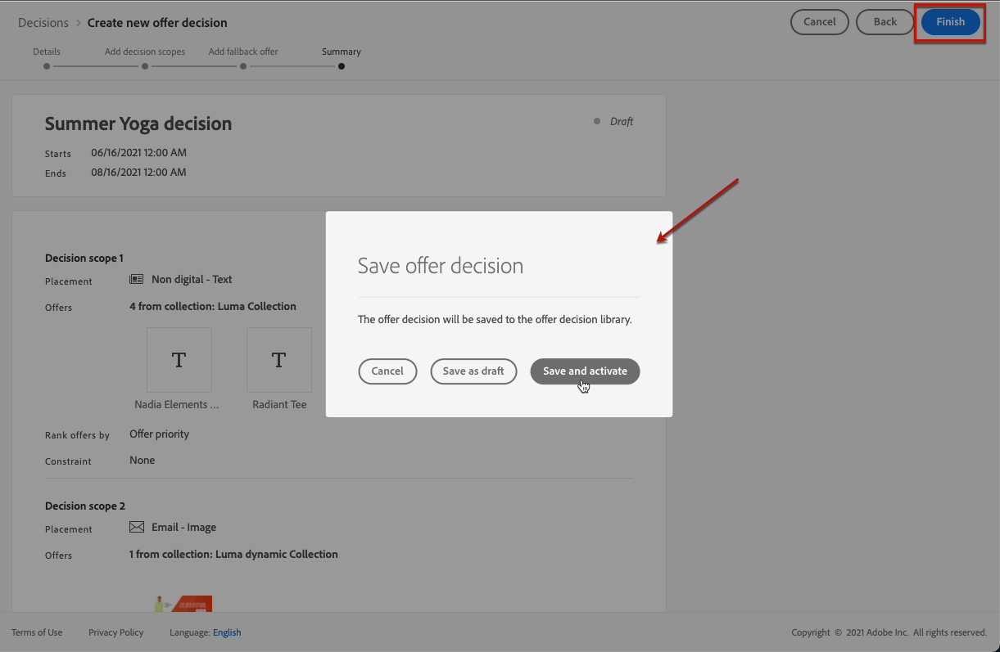

# Create offer activities {#create-offer-activities}

Offer activities are containers for your offers that will leverage the Offer Decision Engine in order to pick the best offer to deliver, depending on the target of the delivery.

 [Discover this feature in video](#video)

The list of offer activities is accessible in the **[!UICONTROL Activities]** menu. Filters are available to help you retrieve activities according to their status or start and end dates.

Before creating an offer activity, make sure that the components below have been created in the Offer Library:

* [Placements](../offer-library/creating-placements.md),
* [Collections](../offer-library/creating-collections.md),
* [Personalized offers](../offer-library/creating-personalized-offers.md),
* [Fallback offers](../offer-library/creating-fallback-offers.md).

## Create the offer activity {#create-activity}

1. Select the **[!UICONTROL Activities]** menu, then click **[!UICONTROL Create activity]**.

1. Specify the activity's name as well as its start and end date and time, then click **[!UICONTROL Next]**.

    

## Add decisions {#add-decisions}

1. Drag and drop a placement from the list to add it to the activity, then click **[!UICONTROL Add collection]**.

    

1. Select the collection that contains the offers to consider, then click **[!UICONTROL Add]**.

    

1. The selected offers are added to the placement. In this example, we selected two offers that will display into a JSON-type placement aimed at presenting offers into a call center solution.

    

1. By default, if multiple offers are eligible for this placement, the offers with the highest priority score will be delivered to the customer.

    If you want to use a specific formula to choose which eligible offer to deliver, select a ranking formula from the **[!UICONTROL Rank offers by]** drop-down list. For more on this, refer to [this section](../offer-activities/configure-offer-selection.md).

1. The **[!UICONTROL Constraint]** field allows you to restrict the presentation of the offers to the members of one or several Adobe Experience Platform segments. To do this, select **[!UICONTROL Segments]**, then click **[!UICONTROL Add segments]**.

    
    
    Add one or several segments from the left pane, combine them using the **[!UICONTROL And]** / **[!UICONTROL Or]** logical operators, then click **[!UICONTROL Select]** to confirm.

    For more on how to work with segments, refer to the [Segmentation Service documentation](https://experienceleague.adobe.com/docs/experience-platform/segmentation/home.html).

    

    If you want to associate a specific decision rule to the offers contained in the placement, select the **[!UICONTROL Decision rule]** option, then drag the desired rule from the left pane into the **[!UICONTROL Decision rule]** area. For more on how to create a decision rule, refer to [this section](../offer-library/creating-decision-rules.md). 

    

## Add a fallback offer {#add-fallback}

Select the fallback offer that will be presented as a last resort to the customers that do not match the offers eligibility rules and constraints, then click **[!UICONTROL Next]**.

## Review and save the offer activity {#review}

If everything is configured properly and your activity is ready to be used to  present offers to customers, click **[!UICONTROL Finish]**, then select **[!UICONTROL Save and activate]**.

You can also save the activity as draft, in order to edit and activate it later on.

The activity displays in the list with the **[!UICONTROL Live]** or **[!UICONTROL Draft]** status, depending on wether you activated it or not in the previous step. 

It is now ready to be used to deliver offers to customers. You can select it to display its properties and edit or suppress it.

>[!NOTE]
>
>Once an offer activity has been created, you can click its name in the list to access detailed information, and vizualise all the changes that have been made to it using the **[!UICONTROL Change log]** tab (see [Offers and offer activities changes log](../get-started/user-interface.md#changes-log)). 

## Tutorial video {#video}

>[!VIDEO](https://video.tv.adobe.com/v/329606?quality=12)
