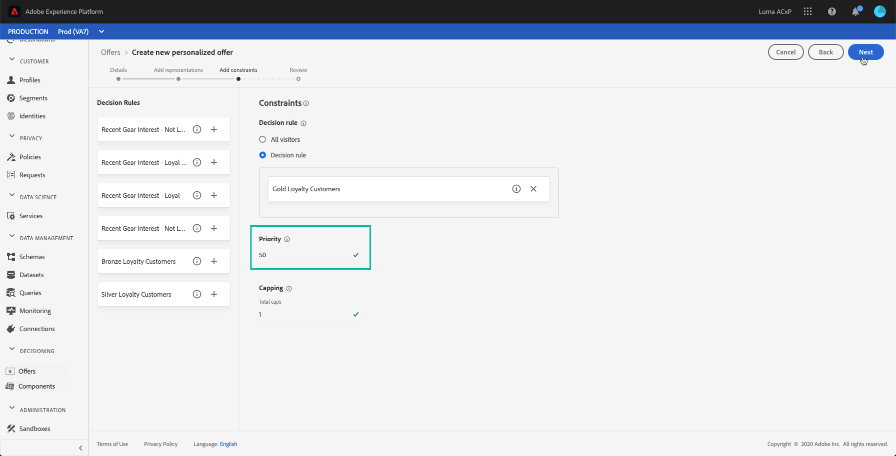
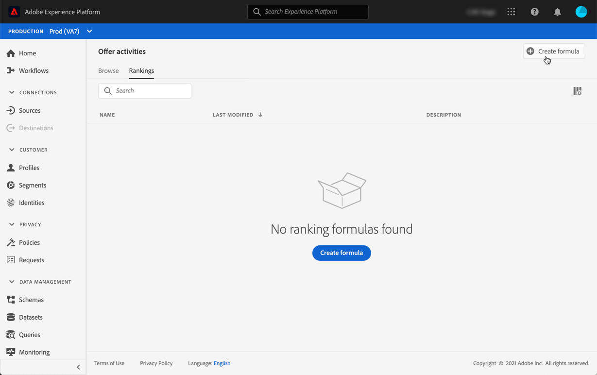

# Configure offers selection in activities {#offers-selection-in-activities}

By default, when several offers are eligible for a given placement, the offers with the highest **priority** will be delivered to the customers first. Offers' priority scores are assigned when creating an offer (see [Create a personalized offer](../offer-library/creating-personalized-offers.md)).

Additionally, Offer Decisioning allows you to create **manual rankings**. These are formulas that determine which offer should be presented first for a given placement, rather than taking into account the offers' priority scores. For example, you can set up a manual ranking that will xxxx

## Create a manual ranking {#create-manuel-ranking}

To create a manual ranking, follow the steps below:

* Access the **[!UICONTROL Activities]** menu, then the **[!UICONTROL Manual rankings]** tab.

* All created manual rankings display here. Click **[!UICONTROL Create formula]** to create a new manual ranking.

    

* Specify the manual ranking name, description, and formula. 

    

* Click **[!UICONTROL Save]**. Your manuel ranking is created, it can now be used in an offer activity to rank eligible offers for a placement.

    

## Assign a manual ranking to an offer activity {#assign-manuel-ranking}

To assign a manual ranking to a placement, follow the steps below:

* Create an offer activity or edit an existing one, then create the placements that will contain your offers (see [Create offer activities(../offer-activities/create-offer-activities.md)).

* For each placement, select **[!UICONTROL Custom ranking]** from the drop-down list, then click **[!UICONTROL Add ranking]**.

    

* Select the desired manual ranking, then click **[!UICONTROL Select]**.

    

The manual ranking is now associated to the placement. If mutiple offers are eligible to be presented in this placement, the offer activity will use the manual ranking's formula to calculate which offer to deliver first.