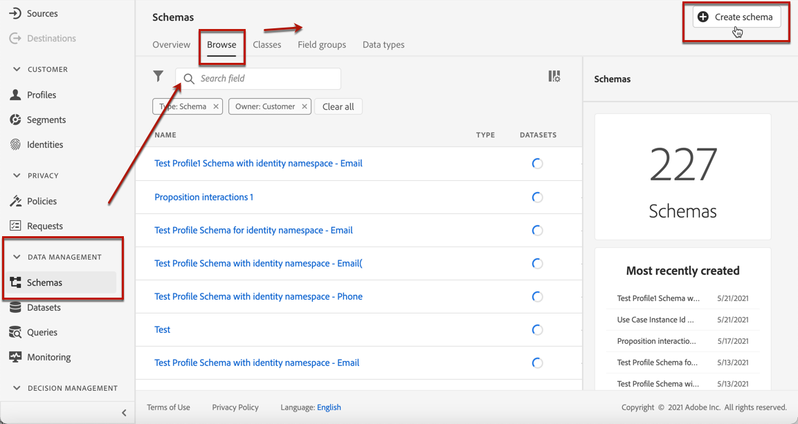
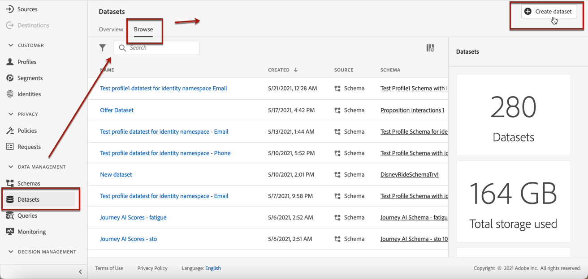

# Create ranking strategies {#create-ranking-strategies}

## About AI ranking

>[!NOTE]
>
>This feature is not enabled by default. To be able to use it, reach out to your Adobe contact.

## Create a ranking strategy {#create-ranking-strategy}

To create a ranking strategy, follow the steps below:

1. Access the **[!UICONTROL Components]** menu, then select the **[!UICONTROL AI rankings]** tab.

    

    All the ranking strategies created so far are listed.

1. Click the **[!UICONTROL Create strategy]** button.

1. Fill in the following fields:

    

    * **[!UICONTROL Name]**: Unique name that you must provide.

    * **[!UICONTROL Model type]**: Currently the only supported model type is **[!UICONTROL Auto-optimization]**.<!--More will be supported in the future so the drop-down list will be enabled.-->

    * **[!UICONTROL Optimization metric]**:
    
        This option enables marketers to choose how machine learn model should be built and trained: based on offers displayed, offers clicked in email, and/or offers clicked on the web.<!--You can choose all of them.-->
    
        All selected impression and/or conversion events (offer clicks via email or web) will be captured using the Web SDK or the Mobile SDK that has been provided.

        There are two types of optimization metrics:
	
        * **[!UICONTROL Impression]**: All impression events (in this case, all offers that are displayed) will be automatically captured by the Web SDK or the Mobile SDK.

        * **[!UICONTROL Conversion]**: Offer clicks are auto-tracked by the Web SDK.

        >[!NOTE]
        >
        >You can select all the options above.

    * **[!UICONTROL Dataset ID]**: You also need to provide a dataset where conversion events are collected. Select the dataset from the drop-down list. This dataset needs to be associated with a schema that must have the **[!UICONTROL Proposition Interactions]** field group (previously known as mixin) associated with it.

    
    
    >[!NOTE]
    >
    >Only the datasets created from schemas associated with the **[!UICONTROL Experience Event - Proposition Interactions]** field group (previously known as mixin) are displayed in the drop-down list. Learn how to create this dataset in [this section](#create-dataset).

1. Save and activate the ranking strategy.

## Creating a dataset to collect events {#create-dataset}

First you need to create a schema:

1. From the **[!UICONTROL Data Management]** menu, select **[!UICONTROL Schema]**, go to the **[!UICONTROL Browse]** tab and click **[!UICONTROL Create schema]**.

    

1. Choose **[!UICONTROL XDM ExperienceEvent]**.

    

    For more on XDM schemas and fields groups, see the [XDM System overview documentation](https://experienceleague.adobe.com/docs/experience-platform/xdm/home.html?lang=en).

1. In the **[!UICONTROL Search]** field, type "proposition interaction" and select **[!UICONTROL Experience Event - Proposition Interactions]** field group (previously known as mixin).

    

1. Click Add field groups.

    

1. Type a name and save the schema.<!--How do you edit the fields in this new schema? Examples?-->

    Learn more on building schemas in [Basics of schema composition](https://experienceleague.adobe.com/docs/experience-platform/xdm/schema/composition.html?lang=en#understanding-schemas).

You're now ready to create a dataset using this schema. To do this, follow the steps below:

1. From the **[!UICONTROL Data Management]** menu, select **[!UICONTROL Datasets]**, go to the **[!UICONTROL Browse]** tab and click **[!UICONTROL Create dataset]**.

    

1. Select **[!UICONTROL Create dataset from schema]**.

    
    
1. Select the schema you just created from the list.
1. Click **[!UICONTROL Next]**.
1. Give a unique name to the Dataset in the **[!UICONTROL Name]** field and click **[!UICONTROL Finish]**.

## Using a ranking strategy {#using-ranking}

To use the ranking strategy you created:

Once a ranking formula has been created, you can assign it to a placement in a decision (previously known as offer activity). For more on this, see [Configure offers selection in decisions](../offer-activities/configure-offer-selection.md).

1. Create a decision.
1. Add a placement.
1. Add a collection.
1. Choose to rank offers by AI ranking (select it from the drop-down list).
1. Click Add ranking.
1. Select the ranking strategy that you created. All the details of the ranking strategy are displayed.
1. Click Next to confirm.
1. Save your decision.

It is now ready to be used in a decision to xxx (see [Configure offers selection in decisions](../offer-activities/configure-offer-selection.md)).

