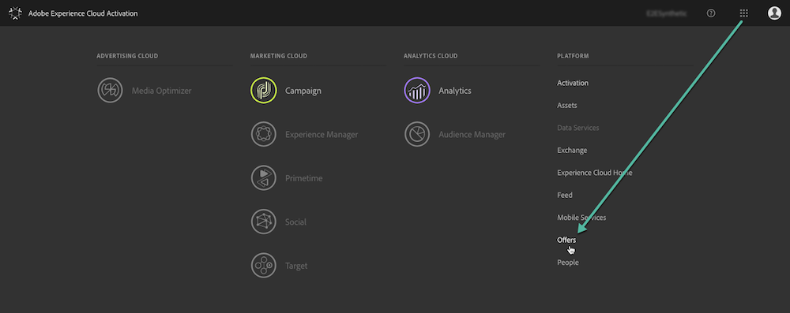
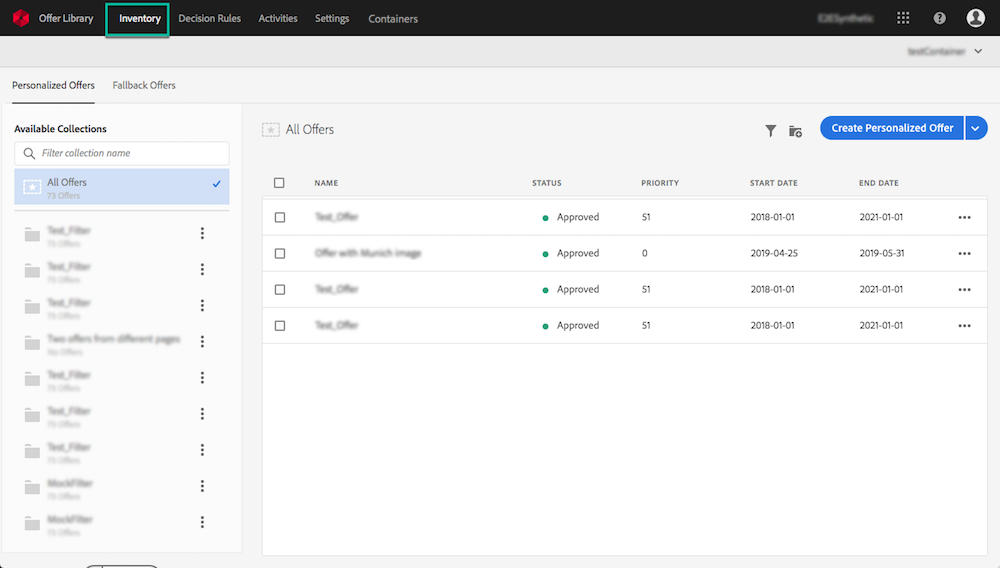
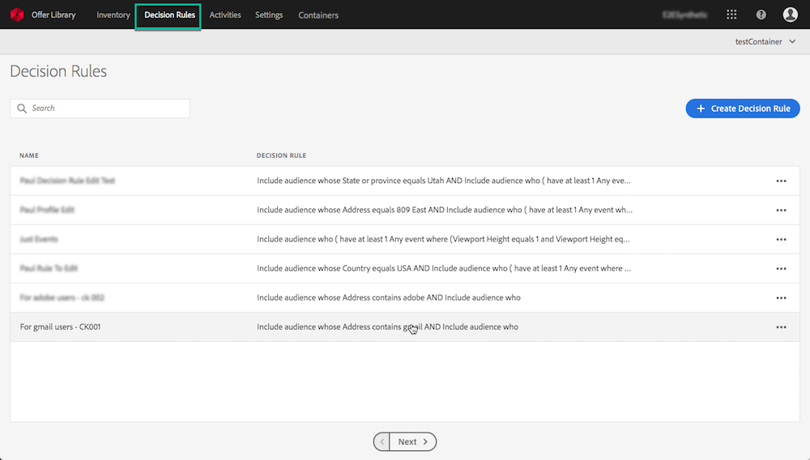

# Accessing the Offer Library {#accessing-the-offer-library}

The Offer Library allows you to create and manage your placements and offers in one single place.

It is accessible from Adobe Experience Cloud Platform Product picker:

* The **[!UICONTROL Inventory]** tab allows you to access your offers or create new ones. See [Creating an offer](../../offer-library/using/creating-offers.md#creating-an-offer).

    

* The **[!UICONTROL Decision Rules]** tab allows you to manage the conditions under which an offer is presented. See [Creating a decision rule](../../offer-library/using/creating-offers.md#creating-a-decision-rule).

    

* The **[!UICONTROL Settings]** tab allows you to manage placements and tags for your offers. See [Creating placements](../../offer-library/using/creating-offers.md#creating-placements) and [Creating tags](../../offer-library/using/creating-offers.md#creating-tags).

    

>[!NOTE]
>
>**[!UICONTROL Activities]** and **[!UICONTROL Containers]** tabs are not part of offers management use cases with Email channel.
