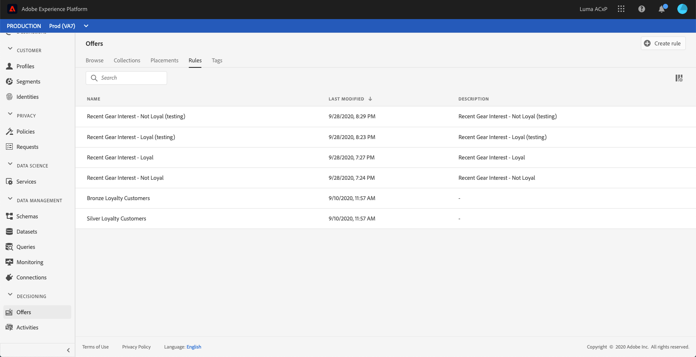

# Creating decision rules {#creating-decision-rules}

You can create offer decision rules based on data available in Adobe Experience Platform. Decision rules determine to whom an offer can be shown.

For example, you can specify that you only want a 'Women's Winter Clothing Offer' to be shown when (Gender = 'Female') and (Region = 'Northeast').

The list of created decision rules is accessible in the **[!UICONTROL Rules]** tab.

To create a decision rule, follow these steps:

1. Go to the **[!UICONTROL Rules]** tab, then click **[!UICONTROL Create rule]**.

    

1. Name your rule and provide a description, then configure the rule according to your needs.
    
    To do this, the **Unified Segment Builder** from Adobe Experience Platform is available to help you build the rule's conditions. For more on how to use it, refer to the [dedicated  documentation](https://docs.adobe.com/content/help/en/experience-platform/segmentation/ui/segment-builder.html).
    
    In this example, the rule will target customers that have the "Gold" loyalty level.

    

    >[!NOTE]
    >
    >The Unified Segment Builder provided to create decision rules presents some specificities compared to the one used with the **[!UICONTROL Audience Destinations]** service. For example, the **[!UICONTROL Segments]** tab is not available for use. However, the global process described in the Unified Segment Builder documentation is still valid to build offers decisions rules.

1. Click **[!UICONTROL Save]** to confirm.

1. Once the rule is created, it displays in the placements list. You can select it to display its properties and edit it. <!-- no suppression?>

    
