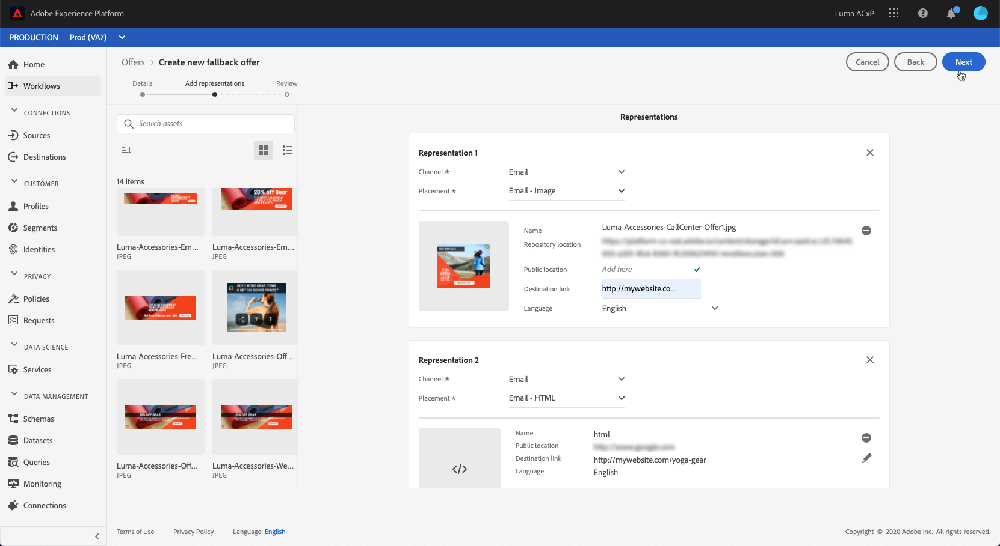
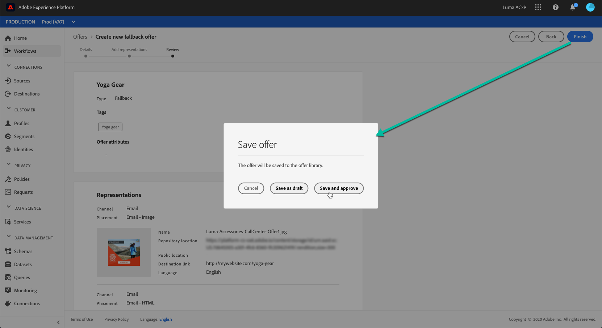
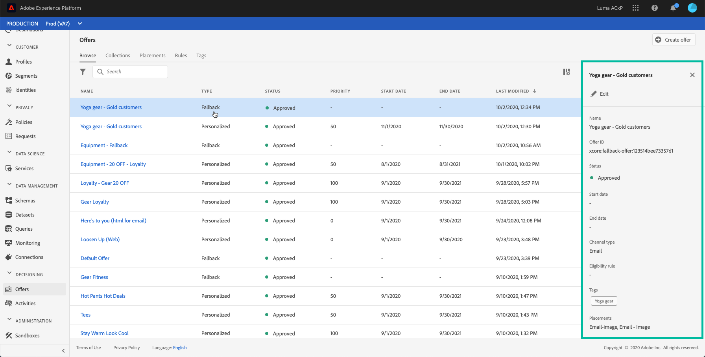

# Creating fallback offers {#creating-fallback-offers}

The fallback offer is sent to customers if they are not eligible for other offers. The steps to create a fallback offer consist in creating one or several representations, like when creating an offer.

The list of fallback offers is accessible in the **[!UICONTROL Browse]** tab, which displays by default when accessing the **[!UICONTROL Offers]** menu.

To create a fallback offer, follow these steps:

>[!NOTE]
>
>Note that, unlike personalized offers, fallback offers have no eligibility rules and constraint parameters, because they are presented to customers as last resorts with no condition.

1. In the **[!UICONTROL Browse]** tab, click **[!UICONTROL Create offer]**, then select **[!UICONTROL Fallback offer]**.

    

1. Specify the fallback offer's name. You can also associate one or several existing tag(s) to it, allowing you to search and organize the Offer Library more easily.

    offers attributes ? TBD, need some input

    
    
1. Create one or several representations for the fallback offer. To do this, drag and drop placements from the left pane, like when creating a personalized offer. See .

    

1. Once the fallback offer's representations have been added, a summary displays. If everything is configured properly and your fallback offer is ready to be presented to customers, click **[!UICONTROL Finish]**, then select **[!UICONTROL Save and approve]**.

    You can also save the fallback offer as a draft, in order to edit and approve it later on.

    

1. The fallback offer displays in the list with the **[!UICONTROL Live]** or **[!UICONTROL Draft]** status, depending on wether you approved it or not in the previous step.

It is now ready to be delivered to customers. You can select it to display its properties and edit it. <!-- no suppression?>

