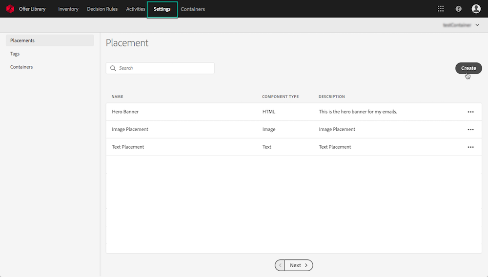
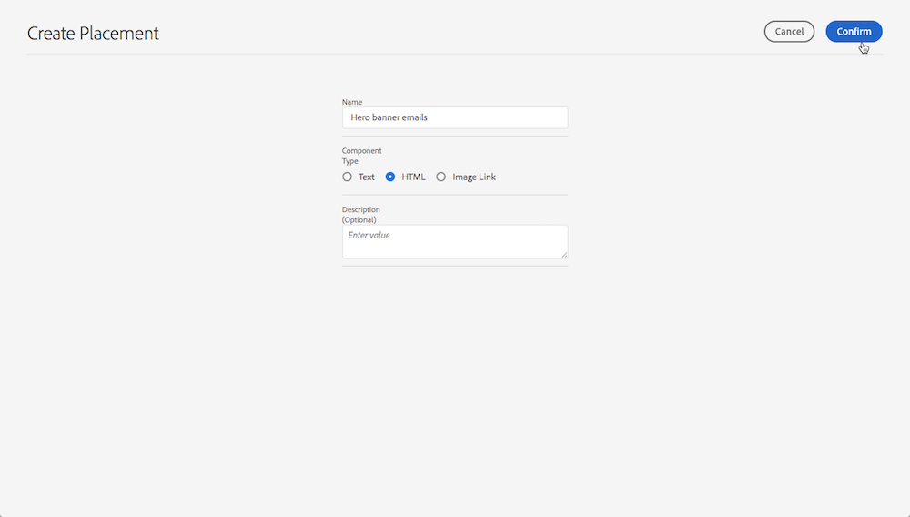
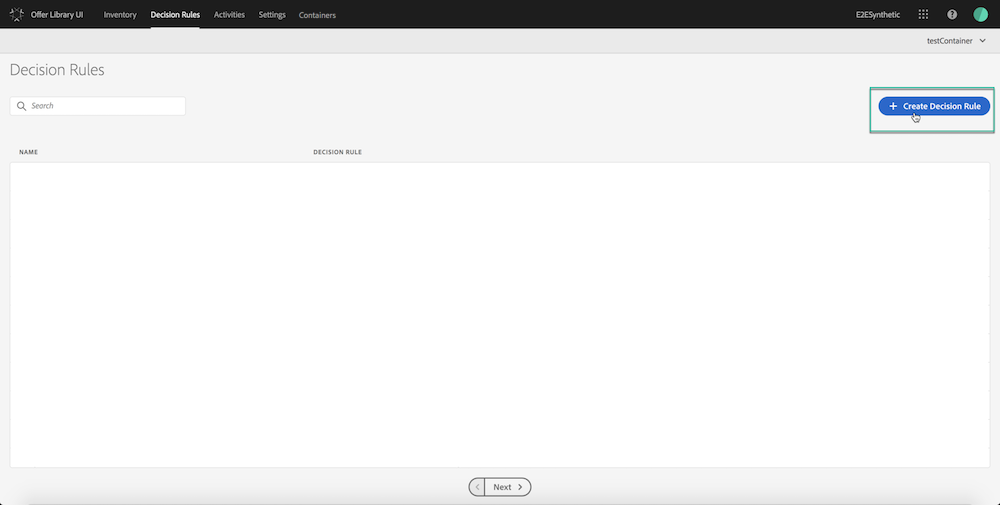

# Creating offers {#creating-offers}

The steps to create an offer are the following:

1. Create a **placement**. A placement is a container that will be used to showcase your offers. You can, for example, create a placement that will be dedicated to offers in the image format only, and situated to the top of your messages. See .
1. Create a **decision rule** that will specify the conditions under which the offer will be presented. See .
1. Create **tags** that you will associate to the offer, allowing you to easily organize and search into the library. See .
1. Create the **content** and **properties** of the personalized offer. See .
1. Create a **fallback offer**, which is the last resort offer to display if a customer is not eligible for any of the offers selected. See 

## Creating placements {#creating-placements}

A placement helps ensure that the right offer content shows up in the right location within your message.

When you add content to an offer, you will be asked to select a placement in which that content can be shown.

In the example below, there are three placements, corresponding to different types of content (image, text, HTML).

To create a placement, follow these steps:

1. Select the **[!UICONTROL Settings]** tab, then click the **[!UICONTROL Create]** button.

    

1. Define the placement's name, then enter a description (optional).

    >[!NOTE]
    >
    >Make sure to define a meaningful name so that it can be retrieved more easily.

1. Specify the type of content that the placement will be allowed to display: Text, HTML or Image Link, then click **[!UICONTROL Confirm]**.

    

1. The placement is created. You can edit or delete it by clicking the **...** button.

    

## Creating a decision rule {#creating-a-decision-rule}

You can create offer decision rules based on data available in Adobe Experience Platform. Decision rules determine to whom an offer can be shown.

For example, you can specify that you only want a 'Women's Winter Clothing Offer' to be shown when (Gender = 'Female') and (Region = 'Northeast').

To create a decision rule, follow these steps:

1. Select the **[!UICONTROL Decision Rules]** tab, then click **[!UICONTROL Create Decision Rule]**.

    

1. Name your rule, then define the conditions corresponding to your needs, using the Unified Segment Builder.

    >[!NOTE]
    >
    >The Unified Segment Builder to create decision rules presents some specificities compared to the one for audiences. The **[!UICONTROL Segments]** tab, for example is not available for use. However, the global process described in the [Unified Segment Builder documentation](https://docs.adobe.com/content/help/en/experience-platform/segmentation/ui/segment-builder.html) is still valid to build offers decisions rules.

    

1. Click Save.

## Creating tags {#creating-tags}

Associating tags to your offers make it easier to keep them organized. For example, you could label your Black Friday offers with the "Black Friday" tag. You can then use the search functionality in the Offer Library to easily locate all of the offers with that tag.

Tags can also be used to group offers together into offer collections. See .

To create a tag, follow these steps:

1. In the **[!UICONTROL Settings]** tab, select the **[!UICONTROL Tags]** section, then click **[!UICONTROL Create]**.

    

1. Specify the tag's name, then click **[!UICONTROL Confirm]**.

    

## Creating an offer {#creating-an-offer}

Before creating an offer, make sure that you created:

* A **placement** in which the offer will be displayed. See 
* A **decision rule** that will define the condition under which the offer will be presented. See .
* One or several **tags** that you want to associate to the offer. See .

Each offer is made up of:

* One or several **Offers Representations**. An offer can be displayed at different places in a message: in a top banner with an image, in text format in a paragraph, and so on.
* **Eligibility and Constraints parameters**. These are rules that will define the conditions under which an offer will be displayed.

To create an Offer, follow these steps:

1. Select the **[!UICONTROL Inventory]** tab, then click the **[!UICONTROL Create Personalized Offer]** button.

    

1. Define the offer's name, then create an offer representation. To do this, drag and drop the placement that will contain the offer into the **[!UICONTROL Create Representations]** area.

    

1. Add content to the offer representation. To this, click the **[!UICONTROL xxx]** icon from the left pane to display the Experience Cloud Library.

1. Drag and drop the desired content (text, image or HTML) into the offer representation area.

    >[!NOTE]
    >
    >Make sure that the content you are selecting corresponds to the content type defined when creating the placement (image, HTML, or text). Otherwise, the offer representation will display in red.

    

    You can also insert text-type content without using the Experience Cloud Library. To do this, click the **[!UICONTROL xxx]** button, then select **[!UICONTROL Add Text]**.

1. In the **[!UICONTROL Text]** field, type the text that will display in the offer.

    >[!NOTE]
    >
    >You will be able to customize the text layout in Campaign once it is inserted into an offer activity.

    

1. For image and text-type content, define the URL to associate with them in the **[!UICONTROL URL]** field.

    >[!NOTE]
    >
    >For now, the **[!UICONTROL Language]** field is not part of offers management use case and should not be used.

1. Repeat these steps to create as many offer representations as needed.

1. Define the offer's eligibility rules and constraints. To do this, select the **[!UICONTROL Eligibility and constraints]** tab, then configure the properties according to your needs:

    * **[!UICONTROL Ranking]**: the offer's priority compared to other offers. The highest an offer's ranking will be, the highest its priority will be compared to other offers.
    * **[!UICONTROL Eligibility]**: associate an existing decision rule to the offer that will define when to present it (for example to women over 30 only, profiles living in London, and so on.) To do this, drag and drop a decision rule from the left pane.
    * **[!UICONTROL Capping]**: the number of times the offer will be presented in total and per user.

        >[!NOTE]
        >
        >The number of times an offer is proposed is calculated at email preparation time.
        >
        >For example, if you prepare an email with a number of offers, those numbers count towards your max cap regardless of whether or not the email is sent.
        >
        >If an email delivery is deleted or if the preparation is done again before being sent, the capping value for the offer is automatically updated.

    

    In the example above:

    * The offer ranking is set to "300", meaning the offer will be presented before offers with a capping value between 1 and 299, and after the ones with a capping value of at least 301.
    * The offer will be considered for users with a Gmail email address only.
    * The offer will be presented a maximum of 500 times, and only once per user.

1. You can associate one or several existing tag(s) to the offer, allowing you to search and organize the Offer Library more easily. To do this, type the first letters of the desired tag then select it. You can also visualize the entire list of tags by pressing the down arrow key.

    

1. Click **[!UICONTROL Save]**, then **[!UICONTROL Approve and Save]** if the offer is ready to be used. Otherwise, click **[!UICONTROL Save Draft]** to save and finalize it later on.

    

## Creating a fallback offer {#creating-a-fallback-offer}

The fallback offer is sent to customers if they are not eligible for other offers. The steps to create a fallback offer consist in creating one or several representations, like when creating an offer.

>[!NOTE]
>
>Creating a fallback offer is mandatory as it is required to use an offer activity in Campaign Standard.

To create a fallback offer, follow these steps:

1. In the **[!UICONTROL Inventory]** tab, select the **[!UICONTROL Fallback Offers]** section, then click **[!UICONTROL Create Fallback Offer]**.

    

1. Create one or several representations for the fallback offer. To do this, drag and drop placements from the left pane, like when creating an offer. See .

    

>[!NOTE]
>
>Fallback offers have no eligibility rules and constraint parameters, as they will be presented as last resorts with no condition.
