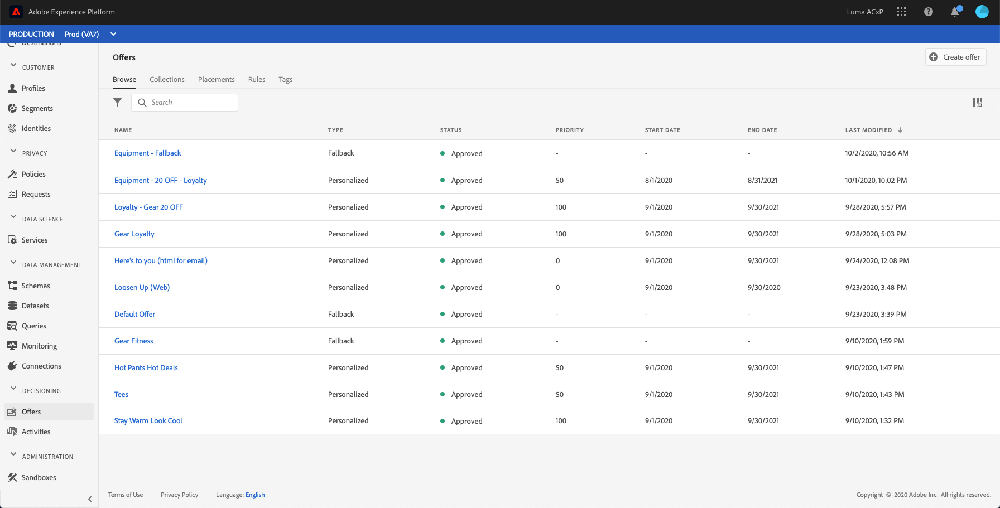
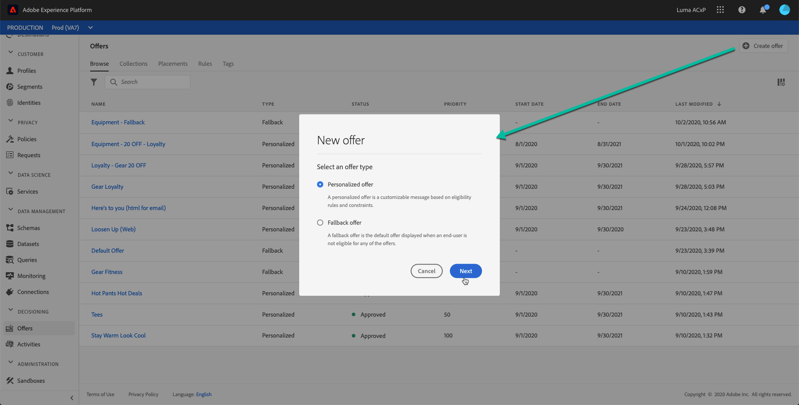
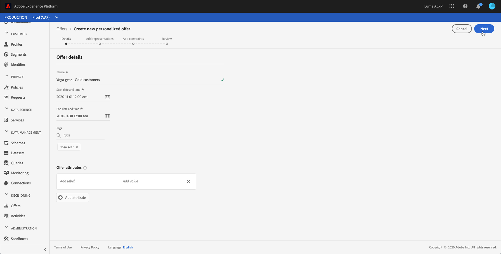
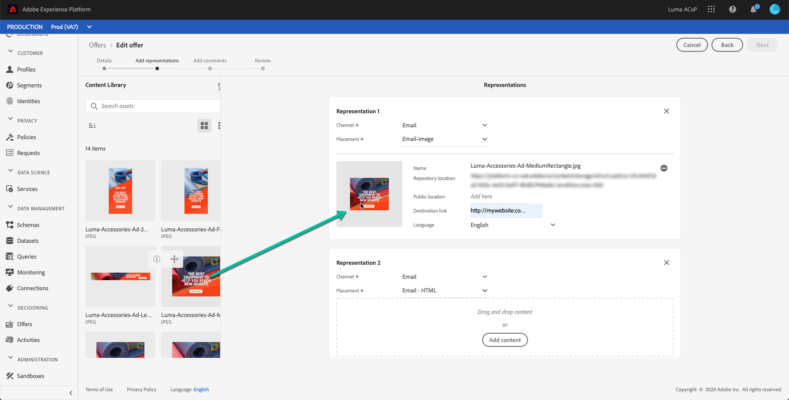
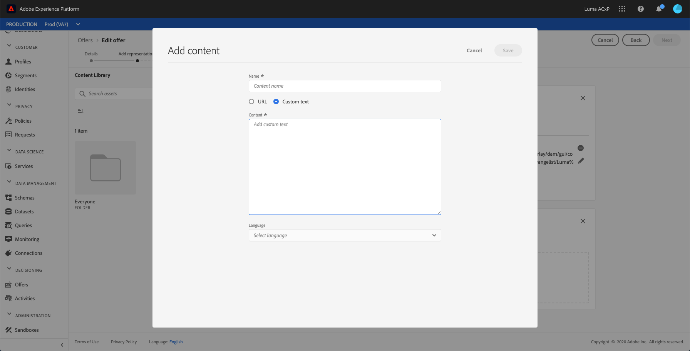
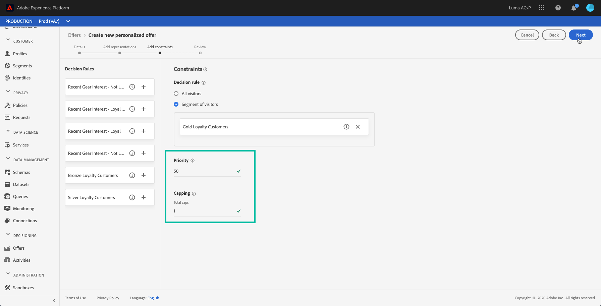
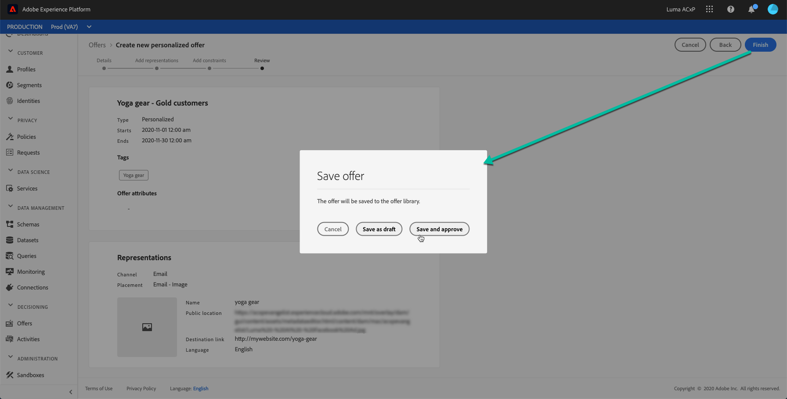

# Create personalized offers {#creating-personalized-offers}

Before creating an offer, make sure that you created:

* A **placement** in which the offer will be displayed. See [Create placements](../../offer-library/using/creating-placements.md)
* A **decision rule** that will define the condition under which the offer will be presented. See [Create decision rules](../../offer-library/using/creating-decision-rules.md).
* One or several **tags** that you want to associate to the offer. See [Create tags](../../offer-library/using/creating-tags.md).

 [Discover this feature in video](#video)

The list of personalized offers is accessible in the **[!UICONTROL Browse]** tab, which displays by default when accessing the **[!UICONTROL Offers]** menu.

To create an offer, follow these steps:

1. In the **[!UICONTROL Browse]** tab, click **[!UICONTROL Create offer]**, then select **[!UICONTROL Personalized offer]**.

    

1. Specify the offer's name as well as its start and end date and time. You can also associate one or several existing tag(s) to the offer, allowing you to search and organize the Offer Library more easily.

    

    >[!NOTE]
    >
    >The **[!UICONTROL Offer attributes]** section allows you to associate key value pairs with the offer for reporting and analysis purposes.
    
1. Add one or multiple representations for your offer using the **[!UICONTROL Add representation]** button.

    >[!NOTE]
    >
    >An offer can be displayed at different places in a message: in a top banner with an image, as text in a paragraph, as an html block etc. The more representations an offer has, the more opportunities exist to use the offer in different placement contexts.

1. For each representation, specify the **[!UICONTROL Channel]** and the **[!UICONTROL Placement]** where the offer will be displayed.

1. Add content to each representation. You can add content coming from Adobe Experience Cloud Assets library, or from an external public location.

    * To add content from Adobe Experience Cloud Assets library, drag and drop it from the left pane into the representation area, then specify the URL to associate with the content in the **[!UICONTROL Destination link]** field.

        >[!NOTE]
        >
        >Note that only content corresponding to the placement's content type is available for use.

        

    * To add content from an external public location, click the **[!UICONTROL Add content]** button, then specify the name, URL, and Destination link of the content to add.

        Make sure that the content you are adding corresponds to the selected placement's content type.

        

    * You can also insert text-type content. To do this, click the **[!UICONTROL Add content]** button, then select the **[!UICONTROL Custom text]** option. In the **[!UICONTROL Text]** field, type the text that will display in the offer.

        >[!NOTE]
        >
        >This option is not available for image-type placements.

        

1. Add eligibility rules and constraint to the offer. These are rules that will define the conditions under which an offer will be displayed.

    1. By default, the **[!UICONTROL All visitors]** decision rule option is selected, meaning that any profile will be eligible to be presented the offer.
    
        If you want to associate a specific decision rule to the offer, select the **[!UICONTROL Decision rule]** option, then drag the desired rule from the left pane into the **[!UICONTROL Decision rule]** area. For more on how to create a decision rule, refer to [this section](../../offer-library/using/creating-decision-rules.md).

        

    1. Define the **[!UICONTROL Priority]** of the offer compared to other ones. The highest an offer's priority will be, the highest its priority will be compared to other offers.

    1. Specify the offer's **[!UICONTROL Capping]**, meaning the number of times the offer will be presented in total per user.

        >[!NOTE]
        >
        >The number of times an offer is proposed is calculated at email preparation time. For example, if you prepare an email with a number of offers, those numbers count towards your max cap regardless of whether or not the email is sent.
        >
        >If an email delivery is deleted or if the preparation is done again before being sent, the capping value for the offer is automatically updated.

        
        
        In the example above:

        * The offer's priority is set to "50", meaning the offer will be presented before offers with a priority between 1 and 49, and after the ones with a priority of at least 51.
        * The offer will be considered for users that match the "Gold Loyalty Customers" decision rule only.
        * The offer will be presented only once per user.

1. Once eligibility rules and constraints have been defined, a summary of the offer properties displays. If everything is configured properly and your offer is ready to be presented to customers, click **[!UICONTROL Finish]**, then select **[!UICONTROL Save and approve]**.

    You can also save the offer as a draft, in order to edit and approve it later on. 

    

1. The offer displays in the list with the **[!UICONTROL Live]** or **[!UICONTROL Draft]** status, depending on wether you approved it or not in the previous step.

    It is now ready to be delivered to customers. You can select it to display its properties and edit or suppress it.

    

Once an offer has been created, you can click its name in the list to access detailed information, as well as vizualise all the changes that have been made to it using the **[!UICONTROL Change log]** tab (see [Offers and offer activities changes log](../../get-started/using/user-interface.md#changes-log)).

## Tutorial video {#video}

>[!VIDEO](https://video.tv.adobe.com/v/329375?quality=12)
