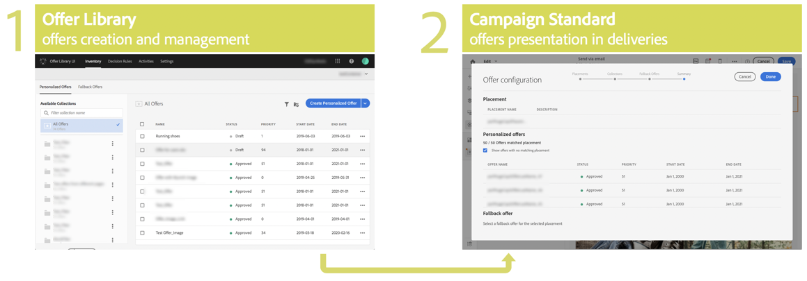

# About Offer Decisioning {#about-offer-decision}

## About the Offer Decisioning service

Offer Decisioning provides offer creation, management, and decisioning, allowing you to continuously deliver the best offer to your customers.

The service is built up of two user interfaces: 

* The **[!UICONTROL Offer Library]** from the Experience Cloud provides a central offer catalog where you can associate eligibility rules and constraints with multiple pieces of content to create and publish offers. See .
* **[!UICONTROL Campaign Standard]** allows you to use offers from the Offer Library into offer activities to send deliveries and report on them. See .

>[!NOTE]
>
>Offer activities in Campaign Standard are available for the email channel only.

Benefits include:

* Improved e-mail campaign performance by delivering more personalized offers in your emails.
* Improved workflow: instead of creating multiple deliveries or campaigns, marketing teams can improve the workflow by creating a single delivery and vary the offers in different parts of the template.
* Enables you to create, manage, and approve offers outside of the Adobe Campaign Standard e-mail campaign workflow.
* Control over the number of times an offer is shown across e-mail campaigns and customers.

## Common use cases

List common use cases linked to offer decisioning
