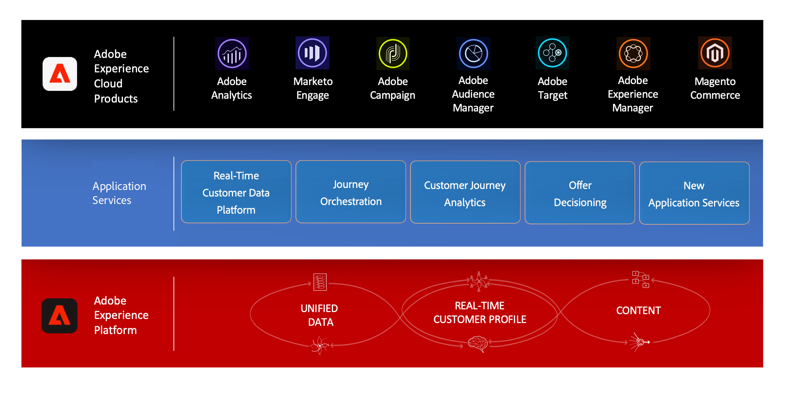
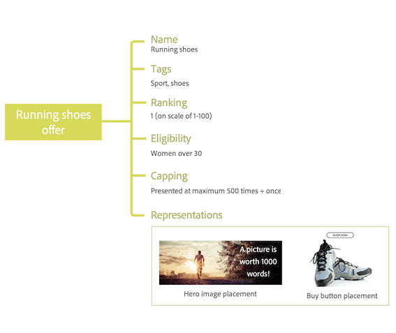

# Get started with Offer Decisioning {#about-offer-decision}

>[!IMPORTANT]
>
>Offer Decisioning is available in beta, and subject to frequent updates and modifications without notice. 

Offer Decisioning is an Application Service integrated with Adobe Experience Platform.

 

It allows you to leverage Adobe Experience Platform Real-time Customer Data to create and continuously deliver the best offer and experience to your customers.

Benefits include:

* Improved campaign performance by delivering personalized offers to your customers,
* Improved workflows: instead of creating multiple deliveries or campaigns, marketing teams can improve workflows by creating a single delivery and vary the offers in different parts of the template,
* Control over the number of times an offer is shown across campaigns and customers. 

>[!NOTE]
>
>In order to be able to use Offer Decisioning, you need to get access to the Offer Decisioning service. For more on this, reach out to Adobe Customer Care or visit [Adobe Enterprise Support page](https://helpx.adobe.com/contact/enterprise-support.ec.html).

## About offers and offer activities {#offers-offer-activities}

An **Offer** is made up of content, eligibility rules and constraints that define the conditions under which it is presented to your customers.

It is created using the **Offer Library**, which is accessible directly from Adobe Experience Platform. It provides a central offer catalog where you can associate eligibility rules and constraints with multiple pieces of content to create and publish offers (see [About the Offer Library](offer-library/using/about-the-offer-library.md)).

 

Once the Offer Library has been enriched with offers, you can integrate your offers into **offer activities** that are delivered through [APIs](https://www.adobe.io/apis/experienceplatform/home/api-reference.html#!acpdr/swagger-specs/decisioning-ode.yaml).

Offer activities are containers for your offers, that will pick the best offer to deliver according to the target of the delivery.

<!-- add screenshot of a sent offer-->

## Common use cases {#common-use-cases}

TBD: list several use cases that can be performed using offer decisioning, including the use cases covered technical marketing tutorial videos.  
